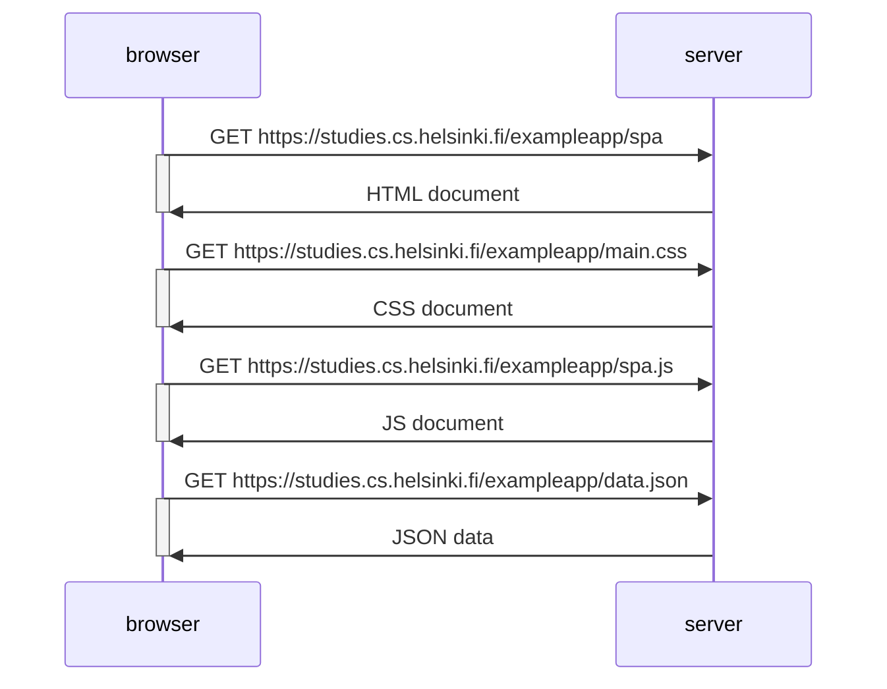

#Exercise 5

```mermaid
sequenceDiagram
    participant browser;
    participant server;
    
    browser ->> server: GET https://studies.cs.helsinki.fi/exampleapp/spa;
    activate browser;
    server ->> browser: HTML document;
    deactivate browser;
    browser ->> server: GET https://studies.cs.helsinki.fi/exampleapp/main.css;
    activate browser;
    server ->> browser: CSS document;
    deactivate browser;
    browser ->> server: GET https://studies.cs.helsinki.fi/exampleapp/spa.js;
    activate browser;
    server ->> browser: JS document;
    deactivate browser;
    browser ->> server: GET https://studies.cs.helsinki.fi/exampleapp/data.json;
    activate browser;
    server ->> browser: JSON data;
    deactivate browser;
```
